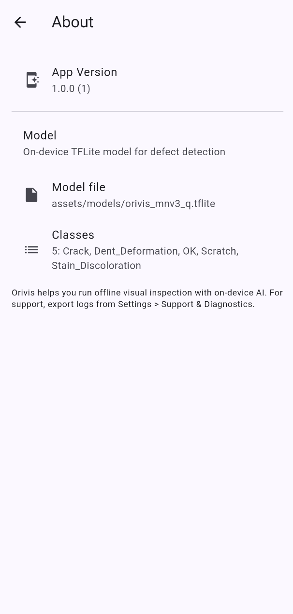

# Orivis

Orivis is a Flutter app for on-device image inspection using a TensorFlow Lite model. It runs fully offline, lets you capture or pick photos, classifies them, and saves inspection records with metadata. A retention policy and manual cleanup help manage storage.

## Features

- On-device inference with TFLite (no network required)
- Camera and gallery input
- Thresholding and simple result UI
- History with search, filters, share, and delete with undo
- Safe persistence with backup and corruption recovery
- Storage retention policy (30 days / 1 year / forever)
- Local logging with export and clear options
- About screen showing app version and model info

## Screenshots

Place screenshots in `assets/screenshots/` and reference them below. Example layout:

<p>
	
	
	
	
</p>

## Getting started

Prerequisites:
- Flutter (stable channel)
- A device or emulator (iOS/Android)

Install dependencies and run:

```bash
flutter pub get
flutter run
```

Run checks locally:

```bash
flutter analyze
flutter test
```

## Model and labels

- Model: `assets/models/orivis_mnv3_q.tflite`
- Labels: `assets/models/labels.txt`

If you retrain or replace the model, keep the filename and update labels accordingly. Document the dataset and training steps under `training/`.

## Privacy

- All inference happens on-device.
- Images are stored locally for inspection history only.
- You control retention from Settings; you can clear saved data anytime.

## Project structure (partial)

- `lib/` — app source (screens, services)
- `assets/` — model and labels
- `training/` — model training scripts

## CI

This repo includes a basic GitHub Actions workflow that runs `flutter analyze` and `flutter test` on pushes and pull requests to `main`/`master`.

## App icon and splash

Provide a 1024x1024 PNG at `assets/app_icon.png`.

- Generate icons:
	- flutter pub run flutter_launcher_icons
- Generate splash:
	- flutter pub run flutter_native_splash:create

You can customize colors and images in `pubspec.yaml` under the `flutter_icons` and `flutter_native_splash` sections.

## License

MIT — see `LICENSE`.

